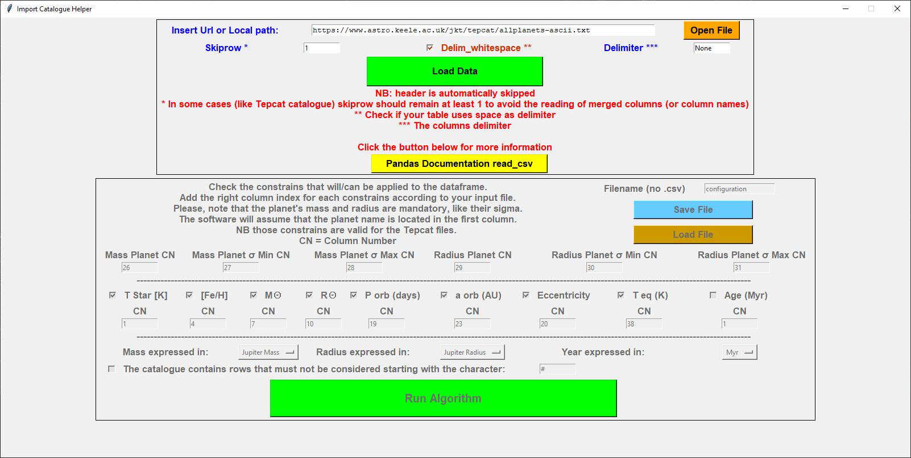
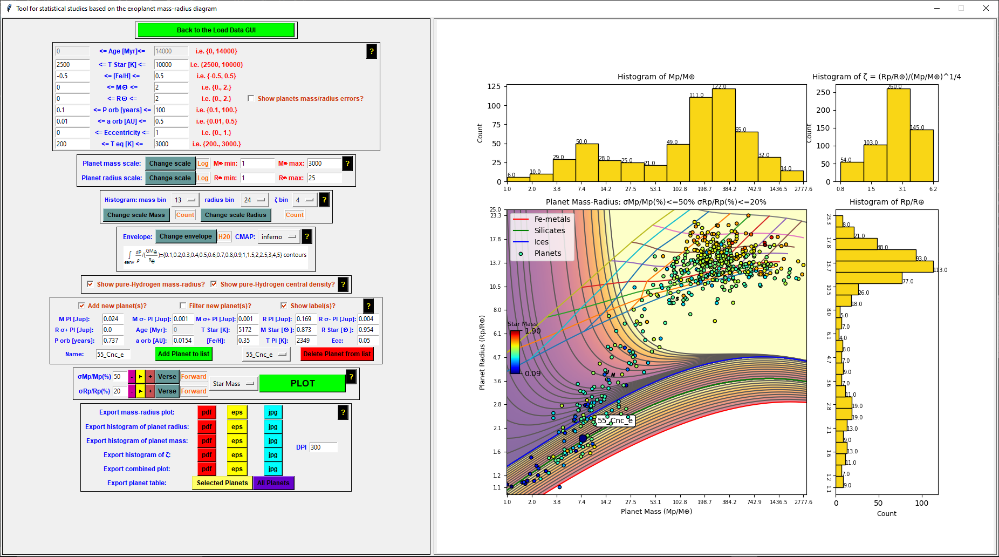

# Summary

We present the python version of the plotting tool originally developed with Mathematica by @Zeng:2021. Our work was motivated by the fact that python is a very popular programming language within the community of astrophysicists, to whom the software is addressed. The code created by @Zeng:2021 represents a very useful tool for visualizing and manipulating data in a multi-dimensional parameter space, and our transposition to python -- with some new utilities with respect to the original version -- can be accessed by a larger number of users interested in exoplanet studies.

# Tool Purpose

@Zeng:2021 presented a software devised to guide the analysis of the mass-radius diagram of extrasolar planets (or exoplanets), i.e. planets discovered in orbit around stars different than the Sun. Examining how extrasolar planets, with measured mass and radius, distribute on such a diagram is a key aspect to understand their diversity, and to investigate their physical structure and composition. We addrees the reader to the orginal paper [@Zeng:2021] for a detailed description of the scientific rationale that inspired this tool. Here, we only recall that the main advantage is the possibility to connect the the planetary mass and radius to many other physical data related to exoplanets and their host stars data. Cross-checking data in a multi-dimensional parameter space, and the opportunity to compare the measurements with models of planetary structure and composition, gives the possibility to identify important patterns which can help interpreting observational results on a statistical basis (as for the case of the so-called "exoplanet radius gap" investigated and intepreted by @Zeng:2021 thanks to this tool).
Our python version, which is entirely based on the original code, has a few new utilities which allow the users, for example, to personalise more their own analysis. **mettere un riferimento a possibili sviluppi futuri del software? Per esempio, che la sua modularità può essere usata per includere altri parametri di interesse? La possibilità di espandere il codice, anche a livello individuale, è senz'altro un valore aggiunto (anche se sarebbe bello che gli sviluppatori restassimo sempre noi)**

# Tool Description and Instructions

This tool is divided in two different GUIs that call each other.

##### First GUI

As the figure above shows, the interface is divided into two macro frames:
-   First frame contains all the widgets used to import the catalog rightness. The user can load his personal exoplanets catalog both by pasting a link (in case the file is from the internet, like the default chosen) or by clicking on the "Open File" button and selecting it from the disk. After that, the user should personalize the import parameters (i.e. skiprow, delimiter) by adapting them to his file. All the parameters information can be found by following the GUI instructions and clicking on the yellow button named "Pandas documentation read_csv", to open the documentation in the browser.
-   Second frame contains the widgets used to adapt the code to the catalog. Six columns are mandatory to fill to run the tool correctly, which are the planet mass and radius plus their sigma errors (superior and inferior). Note that in case a catalog uses only one column to describe both the superior and inferior sigma, the user has just to write the same column index for both of them. Just below, nine planet characteristics are not mandatory but are useful if the user wants to add more filters to the selection of planets that will be plotted in the following GUI. In case a field is selected, the user must provide the corresponding column index in the appropriate text field. The last part of this frame contains two dropdown menus that indicate if the masses and radius are expressed using the Jovian or Earth characteristics, while the last is used to select the unit of measurement of the age column in the catalog (if present). The final personalization widget (if checked) indicates the character used to delete all the rows that contain it in the first column. At the end of the personalization, the user should press the button "Run Algorithm" to transfer all the important information to the second GUI, which is the core of the tool.

##### Second GUI

The second GUI is divided into two macro frames too:
-   The left frame, which in turn is composed of several sub-frames:
    1.   The load data frame, which contains only one button which purpose is to load the previous GUI to use another catalog or to change the current import settings.
    2.   The filter catalog frame, which contains the nine inputs filter related to the nine non-mandatory columns from the first GUI. Those are:
         -   "Age", the age of the system from which the planet is from, could be in Myr or Gyr, depending on the user choice.
         -   "T Star [K]", the surface temperature of the star expressed in Kelvin.
         -   "[Fe/H]", the star's metallicity.
         -   "M☉", the star's mass expressed in Solar mass.
         -   "R☉", the star's radius expressed in Solar radius.
         -   "P orb (days)", the exoplanet orbital period expressed in days.
         -   "a orb (AU)", the semi-major axes of the exoplanet's orbit expressed in AU.
         -   "Eccentricity", the exoplanet's orbit's eccentricity.
         -   "T eq [K]", the equilibrium temperature of the exoplanet expressed in Kelvin.
         It also contains a checkbox that (if active) will show the exoplanet's mass and radius errors bars.
    3.  The running frame, which contains all the widgets used to run properly the internal algorithm and plot the various histograms and graphs. The user can choose a particular upper limit for the error percentage of both mass and radius parameters. To run the current situation (defined by the filters, envelope, and other features) the user has to click the green button "Plot current situation". In case he wants to plot the graphs with a percentage error increased/decreased by one, he could click on the "+"/"-" button corresponding to the parameter (mass or radius) he wants to update. Furthermore, by clicking the "Play" button of the corresponding parameter, the related error upper limit will increase/decrease continuously every four seconds, depending on the verse chosen (Forward/Backward).
    4.   The histogram settings frame, where the user is allowed to change the histograms characteristics, like the amount of bin (one for each histogram, mass, radius, and ζ). He can also choose the "Y" axis scale.
    5.   The envelope frame, where the user can plot (or not) the envelope composition choosing between "H2O", "Silicates", "Fe", or "None". It is also possible to choose the CMAP color by selecting one from the proposed (all of them are default matplotlib CMAP).
    6.   The pure-Hydrogen frame, where the user checks which pure-Hydrogen lines he wants to add to the plot (based on the mass-radius curves concerning the Hydrogen - EOS by Becker et al . 2014 ApJS).
    7.   The new planet frame, where the user can add (and eventually plot) some personal exoplanets by respecting a defined pattern: "['planet-name, Mass, σm+, σm-, Radius, σr+, σr-, T_eq(K), Age]%[...]". It is also possible to choose to filter them using the temperature and to plot the labels permanently.
    8.   The export frame, where is possible to export the following plot in eps, pdf, or jpg format:
         -   Mass-Radius plot.
         -   Mass histogram.
         -   Radius histogram.
         -   ζ histogram.
         -   All the plots in one picture.
         The user can also export in CSV format the complete exoplanets catalog or the filtered catalog (with the currently applied filters).
-   The right frame, which contains the plots only.

# Libraries installation

This tool is developed in Python and use the Tkinter library to generate both the GUI which is composed by.
The software imports some external libraries (i.e. Pillow, Numpy, Pandas) which installation commands are:
-   tkinter: by default with the python distribution. If not, on Ubuntu, "sudo apt-get install python3-tk", on Windows reinstall Python and select Tkinter package;
-   ImageTk: "pip3 install pillow" or "sudo apt-get install python3-pil python3-pil.imagetk" on Linux;
-   Numpy: "pip3 install numpy";
-   Pandas: "pip3 install pandas";
-   matplotlib: "pip3 install matplotlib".
